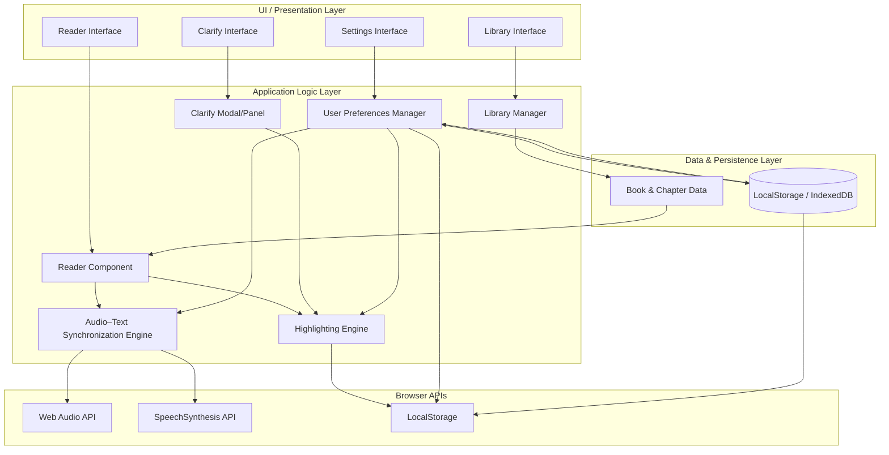

Clarity-Read Architecture Diagram

# CLARITY-READ

CLARITY-READ is an HCI prototype: an active reading assistant designed to help people with dyslexia read more effectively by combining synchronized audio, contextual highlighting, and instant comprehension supports.

**Problem**
Audiobooks and read-aloud tools are primarily passive. When readers lose focus or encounter unfamiliar words or complex sentences, the listening experience breaks down — there is little in-the-moment support that reconnects sound to text and rebuilds comprehension.

**Solution**
An Active Reading Assistant that turns listening into interactive learning: synchronized multi-line highlighting, a fast "Clarify" interaction to explain words or sentences, pre-reading scaffolding, and deep personalization so each reader can tune the experience to their needs.

**Core Features**
- **Synced Highlighting Hub:** Sentence highlighting to preserve context and strengthen the sound–symbol connection.
- **Clarify Button:** A single, prominent control that pauses playback, highlights the current word or sentence, shows a simple definition and sentence simplification, and can play a short, clearer explanation.
- **Deep Customization Suite:** Reader-selectable fonts, highlight and background colors, adjustable highlight pacing (independent of audio speed), and chunk-size controls for tailored tracking.
- **Pre-Reading Scaffolding:** Before chapters, quick primers that introduce key characters/places, short lists of difficult vocabulary with audio, and a concise "story so far" summary to prime comprehension.

**Design Principles**
- Low-friction, immediate interactions that reduce disruption and speed recovery from attention lapses.
- Multi-sensory reinforcement: tightly coupled audio, visual, and short explanatory supports.
- Personalization-first: let users control visual and timing parameters to match reading strategies.

**Target Users**
- Primary: readers with dyslexia seeking supported, active reading experiences.
- Secondary: language learners, readers with attention differences, educators and clinicians.

**Implementation Notes**
This repository contains a front-end prototype with the three core pages: a synchronized Reader UI (with Clarify controls), a Library, and a Settings experience where appearance and highlight behaviors are adjustable. Settings are implemented as UI controls and inform the player and highlighting logic.

**Research & Evaluation**
The project is best validated through targeted usability testing with dyslexic readers. Key metrics include time-to-recover-after-lapse, Clarify usage frequency, and comprehension improvements after short reading sessions.

